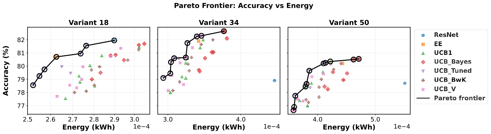
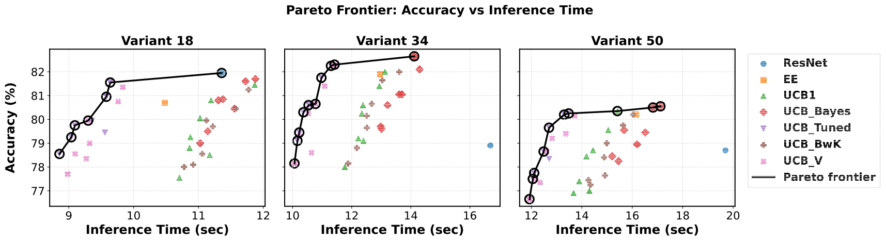
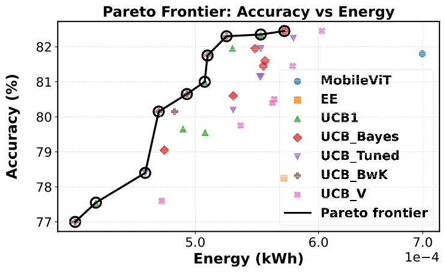
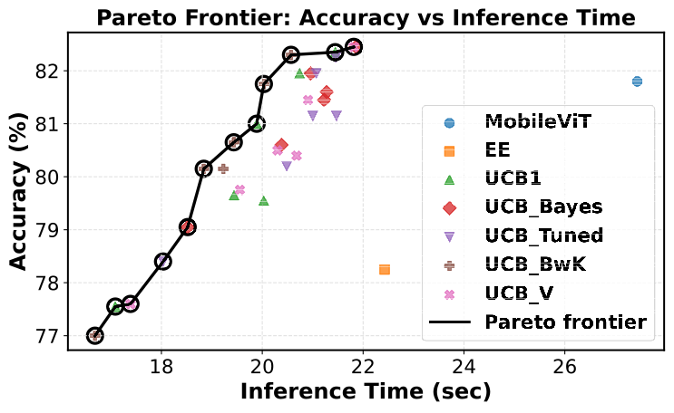
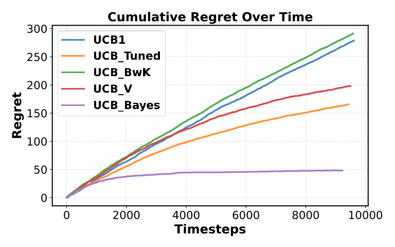
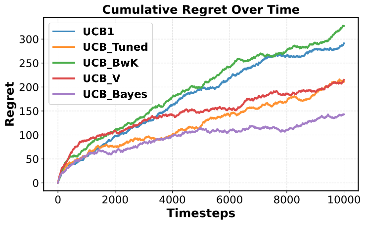

If this repository is useful to you, the following work can be cited:

```
@misc{papanikolaou2026comparativeanalysisperformanceupper,
      title={A Comparative Analysis on the Performance of Upper Confidence Bound Algorithms in Adaptive Deep Neural Networks}, 
      author={Grigorios Papanikolaou and Ioannis Kontopoulos and Konstantinos Tserpes},
      year={2026},
      eprint={2604.24810},
      archivePrefix={arXiv},
      primaryClass={cs.LG},
      url={https://arxiv.org/abs/2604.24810}, 
}
```

# MAB_UCB

<b align="justify"> Adaptive Deep Neural Networks (ADNNs) incorporating Dynamic Depth Sparsity provide the possibility
of skipping entire layers during inference even resulting in early exits sacrificing a certain percentage of accuracy in favor of reduced
latency and energy consumption.</b>

<b align="justify"> This repository contains scripts for training adaptive and non-adaptive, ResNet and MobileViT, 
models. In addition, there is also a script used for evaluating such models in respect to exit distribution, inference
time, energy consumption and accuracy.</b>

<b align="justify"> The decision of ending inference prematurely relies on deciding the optimal threshold. The
unsupervised learning procedure of threshold selection during inference has been studied in the context of Multi-Armed
Bandits framework utilizing mainly UCB1. However, this repository enables the use of other Upper Confidence Bounds 
variants that account for factors such as Bayesian uncertainty, mean cost of reward and variance of rewards.</b>

<b align="justify">Not only is it visible that there are variants besides UCB1 dominating Pareto Frontiers:</b>

<p> ResNet variants Pareto frontiers across different sets of arms for accuracy-inference time and accuracy-energy
consumption on CIFAR10.1v6</p>





<p> MobileViT Pareto frontiers across different sets of arms for accuracy-inference time and accuracy-energy
consumption on CIFAR10.1v6</p>





<b align="justify">But cumulative regret convergence is also different in respect to the chosen UCB algorithm:</b>

<p> MobileViT and ResNet cumulative regret across time steps for CIFAR-100 and CIFAR-10 testing sets respectively.</p>





Note: The experiments revolving around inference were run on a single L4 GPU.
